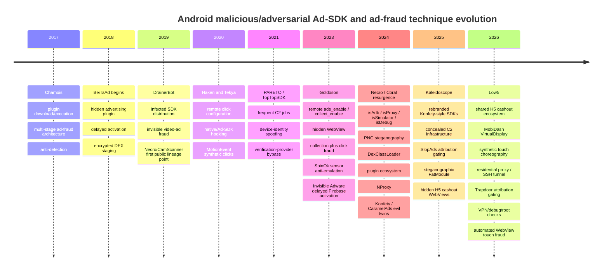
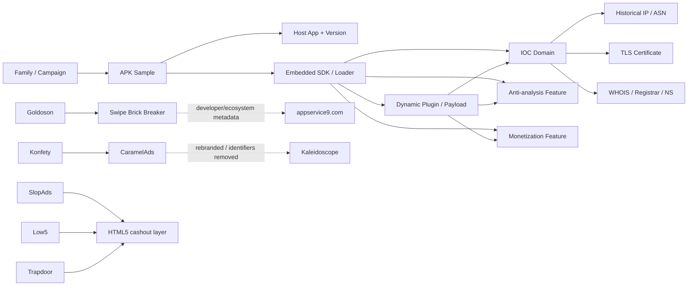

# Goldoson-Like Android Ad-SDK Malware: Verified Corpus, Infrastructure Evidence, and Technique Lineage

## Executive summary

The proposed chain—

**Goldoson → SpinOk → Invisible Adware → Necro/Coral → Konfety/CaramelAds → Kaleidoscope → SlopAds → MobiDash → Trapdoor**

—is useful as an **evolutionary sequence of techniques**, but the evidence does **not** support treating it as a single malware-family or actor lineage. The strongest direct lineage in the list is **Konfety/CaramelAds → Kaleidoscope**, because IAS explicitly describes Kaleidoscope as the fraud model adapting after CaramelAds/Konfety exposure. HUMAN likewise documents a recurring **SlopAds → Low5 → Trapdoor** monetization/evasion pattern around HTML5 cashout infrastructure and attribution-based selective activation. citeturn20search1turn21search1turn21search0

The biggest correction is **Necro**. Necro does not begin in 2024: Kaspersky traced the family back to the **2019 CamScanner incident**, when malicious code was found in an advertising component of an app with more than 100 million installs. The 2024 Coral/adsrun campaign is therefore a **resurgence/evolution of an older lineage**, not a post-Goldoson invention. Its 2024 incarnation added or exposed steganographic loading, `DexClassLoader`, modular plugins, explicit `isAdb/isProxy/isSimulator/isDebug` telemetry, hidden WebView execution and NProxy tunnelling. citeturn19search0

More importantly, several important precursors were missing from the working sequence. The most relevant are:

**Chamois (2017)** for multi-stage plugin delivery and anti-detection; **BeiTaAd/BeiTaPlugin (2018–2019)** for a malicious advertising plugin hidden as encrypted DEX with 24-hour-to-two-week delayed activation; **DrainerBot (2019)** for infected-SDK distribution plus invisible video-ad fraud; **Haken/Tekya (2020)** for remotely configured click fraud and synthetic `MotionEvent` clicks; and **PARETO/TopTopSDK (2021)** for a remotely controlled advertising SDK that turned phones into fraudulent CTV impression bots and explicitly attempted to bypass fraud-verification providers. citeturn17search2turn17search0turn17search1turn17search5turn17search3turn24search2

That changes several “first appearance” conclusions. **Synthetic Android touch injection existed publicly by 2020**, years before MobiDash. **Malicious ad-SDK delivery and invisible advertising existed by 2019**. **Dynamic/plugin loading in Android ad-fraud malware existed by 2017–2019**. What is unusual about the later operations is therefore not any one primitive but their combination: selective activation, analysis-environment detection, encrypted/steganographic staging, hidden real WebViews, interaction choreography, identity spoofing, and residential-proxy monetization. citeturn17search2turn17search3turn18search2turn21search1

Goldoson itself remains unusually interesting. McAfee documented per-app obfuscated domains and library names, server-controlled `ads_enable`/`collect_enable`, sensitive collection, and customized hidden WebViews, but **did not document the packet-capture/security-app denylist found in your analysis**. McAfee's published IOC list contains 27 domains, none of which is one of your five additional domains. If the five application/package checks and the five domains are binary-confirmed in the same historical Goldoson SDK subgraph, they represent worthwhile additions to the public record. citeturn18search0

The initial conceptual lineage supplied for this investigation should therefore be preserved as a research hypothesis rather than an attribution statement. fileciteturn0file0

My recommended **58-artifact first corpus** is:

| Priority | Corpus | Artifacts |
|---|---|---:|
| P0 | Goldoson infected/clean historical pairs | 10 |
| P0 | SpinOk | 3 |
| P0 | Invisible Adware | 4 |
| P0 | Necro/Coral and payload stages | 7 |
| P0 | Konfety | 5 |
| P0 | Kaleidoscope clean/evil twins | 4 |
| P0 | SlopAds | 5 |
| P0 | MobiDash | 4 |
| P0 | Trapdoor | 5 |
| P1 | Chamois | 1 |
| P1 | BeiTaAd | 2 |
| P1 | DrainerBot | 2 |
| P1 | Haken/Tekya | 2 |
| P1 | PARETO/TopTopSDK | 2 |
| P1 | HiddenAds comparator | 2 |
| **Total** |  | **58** |

AdwareZoo should be added as the **background/control corpus**, not used as a substitute for the focused set. The peer-reviewed dataset contains **15,996 samples from 118 families**, and its repository publishes family-specific SHA-256/MD5 lists plus payload-location and characterization metadata. The paper also found that more than 30% of families put payloads outside conventional Java/Kotlin code, directly supporting the multi-representation Joern/CodeQL/Jimple strategy you have already adopted. citeturn24search0 fileciteturn3file0L2-L10

## Corpus scope and corrected evolutionary lineage

The evidence supports three overlapping histories rather than one arrow.

The first is the **malicious/adversarial SDK history**: BeiTaAd, DrainerBot, PARETO, Goldoson, SpinOk and Necro all demonstrate that application developers or repackagers can acquire or include an advertising/monetization component whose behavior is substantially more aggressive than the apparent host application. DrainerBot was explicitly reported as code distributed through an infected SDK; Goldoson was explicitly described as a third-party library; SpinOk was distributed as a marketing SDK; PARETO's fraud engine was `toptop.sdk`; and the 2024 Necro campaign involved `adsrun` initializing Coral SDK. citeturn17search1turn18search0turn16search3turn24search2turn19search0

The second is the **anti-analysis and conditional-execution history**. BeiTaAd delayed visible activity for 24 hours to as long as two weeks; SpinOk used sensor information in an emulator-detection decision; Necro exposed explicit ADB/proxy/simulator/debug state and some plugins performed debugger/ADB checks; SlopAds inspected install attribution, debugger state, emulator state and root state; MobiDash checks Android build artifacts, kills the process when emulation is detected and bypasses ordinary HTTP proxies with `Proxy.NO_PROXY`; Trapdoor checks organic/non-organic attribution plus root/debug/VPN risk signals. citeturn17search0turn16search3turn19search0turn21search1turn18search2turn21search0

The third is the **ad-fraud monetization history**. Invisible video/background ads precede Goldoson; Android synthetic touch fraud is public by Haken/Tekya in 2020; PARETO generated fake CTV impressions without rendering an ad to the victim; Goldoson hid recursive web traffic in a customized WebView; Necro's later modules could operate invisible WebViews and tunnels; SlopAds moved the fraud into hidden WebViews visiting actor-controlled HTML5 cashout sites; MobiDash renders genuine ads in a `VirtualDisplay` and injects realistic `MotionEvent` sequences; and Trapdoor similarly performs choreographed `dispatchTouchEvent` gestures against hidden WebViews. citeturn17search1turn17search5turn17search3turn24search2turn18search0turn19search0turn21search1turn18search2turn21search0



This is a **technique timeline**, not evidence that the same developers operated all campaigns. The strongest publicly documented continuity is Necro's own 2019→2024 family history, Konfety→Kaleidoscope's adaptation of the CaramelAds model, and SlopAds/Low5/Trapdoor's reuse of HTML5 cashout and selective-activation concepts. citeturn19search0turn20search1turn21search4turn21search5

The additional families should be classified as follows:

| Family/campaign | Why it belongs | Position | Confidence |
|---|---|---|---|
| **Chamois** | Ad-fraud Android PHA, additional plugins, detection evasion | Historical precursor | High. Google primary report. citeturn17search2 |
| **BeiTaAd / BeiTaPlugin** | Advertising plugin, encrypted DEX, delayed execution, package hiding | Direct Ad-SDK precursor | High. Lookout primary analysis. citeturn17search0turn17search4 |
| **DrainerBot** | Infected monetization SDK, invisible video impressions | Direct Ad-SDK/ad-fraud precursor | High. Oracle primary disclosure. citeturn17search1 |
| **Haken** | Remote configuration, Ad-SDK manipulation, `MotionEvent` click simulation | Click-fraud precursor | High. Check Point primary analysis. citeturn17search5 |
| **Tekya** | Native obfuscation plus `MotionEvent`-generated ad clicks | Click-injection precursor | High. Check Point primary analysis. citeturn17search3 |
| **PARETO / TopTopSDK** | Proprietary SDK, C2 jobs every 30 s, identity spoofing and anti-fraud-verification code | Direct SDK/fraud precursor | High. HUMAN technical report. citeturn24search2 |
| **HiddenAds** | Useful negative/control family for delayed and remote ad behavior | Comparator, not necessarily SDK lineage | High for behavior; low for lineage. citeturn18search10 |
| **Low5** | 63 Android apps plus >3,000 H5 domains laundering multiple fraud schemes | Adjacent 2026 cashout branch | High. HUMAN primary report. citeturn21search5 |

I would **not** add ordinary HiddenAds variants, Mandrake, Joker, Harly, or unrelated Android loaders to the core lineage merely because they use WebViews or anti-analysis. Mandrake, for example, has sophisticated emulator/root checks and certificate pinning, but its objective is spyware rather than the Ad-SDK/ad-fraud monetization problem under study. It is valuable as an anti-analysis control, not as lineage evidence. citeturn19search3

## Reproducible corpus and acquisition table

The corpus should retain four separate levels of identity:

`host APK → embedded SDK/loader → dynamically loaded stage → plugin/module`.

Collapsing those into a single “sample” will make Necro, MobiDash and later campaigns impossible to compare cleanly.

### Core corpus table

| Family / aliases | Date and public analysis | Representative samples / host versions | SDK/package/class/string anchors | Sample source and retrieval | Confidence |
|---|---|---|---|---|---|
| **Goldoson / Android/Goldoson** | McAfee, 2023-04-12 | McAfee gives packages but **no public hashes** in the report. Prioritize `com.Monthly23.SwipeBrickBreaker`, `com.realbyteapps.moneymanagerfree`, `com.skt.tmap.ku`, `com.gretech.gomplayerko`, `com.lottemembers.android`, with infected/clean temporal pairs. citeturn18search0 | `ads_enable`, `collect_enable`; per-host mutating/obfuscated SDK names and domains; hidden customized WebView. citeturn18search0 | AndroZoo package/version reconstruction; Koodous package/domain YARA. | **High** for family behavior, **Medium** until each historical APK is binary-verified. |
| **SpinOk / Android.Spy.SpinOk** | Dr.Web, 2023-05-29 | SHA256 `3745e0fb7edbdd8da57f44f5ee1d2b2cc0db5d7f8b63ea69ce12ce561402cf17`; MD5 `92e95c692fb97e11ed1d526f22374bb8`; VicTube 1.1.2. Also retrieve Zapya 6.3.3–6.4 and clean 6.4.1. citeturn24search1turn16search3 | Dr.Web identifies marketing SDK; fixed SDK package `com.spin.ok.gp` v2.4.2 no longer contained spyware functionality. Sensor telemetry is used for emulator detection. citeturn16search3 | MalwareBazaar directly has the VicTube sample; AndroZoo/Koodous for historical host versions; Triage by SHA256. citeturn24search1 | **High** |
| **Invisible Adware / Android/Clicker** | McAfee, 2023 | `band.kr.com` SHA256 `f3e5aebdbd5cd94606211b04684730656e0eeb1d08f4457062e25e7f05d1c2d1`; `com.dmb.media` `6aaaa6f579f6a1904dcf38315607d6a5a2ca15cc78920743cf85cc4b0b892050`; `dmb.onair.media` `a98c5170da2fdee71b699ee145bfe4bdcb586b623bbb364a93bb8bdf8dbc4537`; `easy.kr` `5ec8244b2b1f516fd96b0574dc044dd40076ff7aa7dadb02dfefbd92fc3774bf`. | Weeks-long latent period; Firebase Storage/Messaging remote configuration; background ad rendering. citeturn18search1 | SHA256 lookup in AndroZoo, Koodous, MalwareBazaar and Triage. | **High** |
| **Necro / Coral / adsrun** | Family public by 2019; major resurgence 2024 | Spotify Plus 18.9.40.5 MD5 `acb7a06803e6de85986ac49e9c9f69f1`; Wuta Camera 6.3.6.148 `1cab7668817f6401eb094a6c8488a90c`; 6.3.5.148 `30d69aae0bdda56d426759125a59ec23`; 6.3.4.148 `4c2bdfcc0791080d51ca82630213444d`; WhatsApp-mod loader `0898d1a6232699c7ee03dd5e58727ede`; intermediate `37404ff6ac229486a1de4b526dd9d9b6`; shell payload `fa217ca023cda4f063399107f20bd123`; NProxy `ed6c6924201bc779d45f35ccf2e463bb`. citeturn19search0 | `adsrun`; Coral SDK; `libcoral.so`; `sdk.fkgh.mvp.SdkEntry.run`; `isAdb`, `isProxy`, `isSimulator`, `isDebug`; `PluginServer`, `PMask`. citeturn19search0 | Search all MD5s in Koodous/VT-equivalent repositories; AndroZoo for Wuta clean/infected versions. | **High** |
| **Konfety / CaramelAds** | HUMAN 2024; Zimperium evolved variant 2025 | Zimperium publishes 26 SHA256 values. Start with `0bc62ee202ec3022da280dfec839e4dec0800bb421ed482a657abf7aaf6f9c10`, `2d26502ff7a99c0df781ea7830fbafef621ff5c592a0803e63784f9b3d85d4ce`, `eadcb8d177ef3fe5de6d0999d4f854485f79f832593c375491361b6a3e23d595`, `3b6cdd4d708c3c79c7c2adbb2394293797a2c9cace8f724a14ed1dfa49d4a025`, `6dc9d8c1cf11138eccea44e3662b044879f9721c22d6e3a90a1fdb76e674260e`. fileciteturn5file0L2-L2 | Modified CaramelAds SDK; `api.advancedspot.com`; check/event/config/click/select/shown API model; 2025 variant encrypted asset DEX and malformed ZIP structure. citeturn20search4turn20search0 | Zimperium's public IOC GitHub directory contains `apks.csv` and `mimicked-packages.csv`. fileciteturn4file0L2-L10 | **High** |
| **Kaleidoscope** | IAS, 2025-05 | Public report identifies >130 app IDs; hashes **unspecified/not found** in the primary public page. | Clean/evil twins share app ID; identifiers from exposed CaramelAds ecosystem stripped/repackaged; new SDK names and C2 domains. citeturn20search1 | Retrieve IAS app-ID list/full report, then pair official-store versions with third-party/AndroZoo/Koodous variants. | **High** for operational relationship to Konfety model; **Medium** at sample level until evil twins obtained. |
| **SlopAds** | HUMAN, 2025-09-16 | 224 apps; hash list **unspecified/not found** in public text. Use official app-list CSV/HTML as package seed. citeturn21search1 | Firebase Remote Config → encrypted config → four PNG chunks → `FatModule`; attribution gating; debugger/emulator/root checks; hidden WebViews; `ad2.cc` tier-two C2. citeturn21search1 | Official HUMAN app list → AndroZoo/Koodous historical package retrieval. | **High** |
| **MobiDash** | Jamf, 2026-05-13 | SHA256 `1226d486ff206c21224b95019747b70ea23ba17325cef0d611cefce174c6bea3`; `f258160bec07d5009805edecc653ea08d1a4aca0744b45c94ca12e0780981d0e`; `c64db66f16ea74d771024c77a38ce149987654456a8c2f7f23a66eec046b7101`; `3011e7698f8a18194a492cd8c9f345c0492c115edc82640c28a15680e20e5570`. citeturn18search2 | ContentProvider bootstrap, SQLCipher payload DB, certificate-derived key, `Proxy.NO_PROXY`, `InMemoryDexClassLoader`, `VirtualDisplay`, `Presentation`, `dispatchTouchEvent`, JSch/SSH and SOCKS5. citeturn18search2 | Hash lookup across repositories; Triage/AndroZoo/Koodous where available. | **High** |
| **Trapdoor** | HUMAN, 2026-05-19 | 455 Android apps; individual hashes **unspecified/not found** in public report. HUMAN supplies App List and C2 Domain List. citeturn21search0 | `tracker_name` organic/non-organic gating; encrypted asset ZIP; `move.txt`, `click.txt`, `TouchConfig`, `TouchData`, `dispatchTouchEvent`; `/api/referrer`; `riskPaths`; root/debug/VPN checks; hidden WebView. citeturn21search0 | HUMAN app-list CSV → AndroZoo/Koodous; C2-domain list → URL/domain hunting. | **High** |

For Konfety, the public Zimperium repository is especially valuable because it provides stable, reproducible hash seeds independently of commercial malware repositories. The IOC directory and its hash list are currently present in GitHub. fileciteturn4file0L2-L10 fileciteturn5file0L2-L2

For the larger background corpus, AdwareZoo's repository explicitly says its `SampleHashes/` directory contains SHA-256 or MD5 lists for **118 distinct families**, while its spreadsheets document sample counts, tag naming patterns, payload locations, variants and behavioral characterization. fileciteturn3file0L2-L10 The corresponding peer-reviewed paper reports 15,996 samples and dynamic payload loading/package obfuscation among the observed evasion strategies. citeturn24search0

### Exact retrieval recipes

AndroZoo is best used for **historical host-version reconstruction**, especially Goldoson, Kaleidoscope, SlopAds and Trapdoor. Its official API requires a personal API key and SHA-256 and documents this exact download form; its metadata API can also return all historical Google Play metadata records for a package. citeturn14search0turn14search4

```bash
# Download known SHA256
curl -O --remote-header-name -G \
  -d apikey="${APIKEY}" \
  -d sha256="${SHA256}" \
  https://androzoo.uni.lu/api/download

# Retrieve all Google Play metadata AndroZoo has for one package.
curl -G \
  -d apikey="${APIKEY}" \
  "https://androzoo.uni.lu/api/get_gp_metadata/com.Monthly23.SwipeBrickBreaker"

# Local search of the nightly AndroZoo catalogue.
zgrep -F 'com.Monthly23.SwipeBrickBreaker' latest.csv.gz
zgrep -F 'com.realbyteapps.moneymanagerfree' latest.csv.gz
zgrep -F 'com.skt.tmap.ku' latest.csv.gz
```

AndroZoo requests that researchers respect its legal/access conditions, not redistribute the corpus, and publish lists of apps used for reproducibility. citeturn14search1

Koodous supports plain hash/package search, certificate search, and YARA enhanced with its Androguard module. Official examples use expressions such as `package: com.whatsapp`, `cert: <SHA1>`, `androguard.package_name(...)`, `androguard.certificate.sha1(...)` and `androguard.url(...)`. citeturn14search10turn14search3

Use:

```text
package: com.Monthly23.SwipeBrickBreaker
package: com.realbyteapps.moneymanagerfree
package: com.skt.tmap.ku

3745e0fb7edbdd8da57f44f5ee1d2b2cc0db5d7f8b63ea69ce12ce561402cf17

certificate: <SHA1_FROM_FIRST_CONFIRMED_GOLDOSON_HOST>
```

MalwareBazaar supports `get_info` for SHA256/MD5/SHA1 and `get_file` for SHA256. Downloaded files are AES-encrypted archives with password `infected`. citeturn14search5

```bash
# Check whether a sample exists.
curl -sS \
  -H "Auth-Key: ${MB_AUTH}" \
  --data "query=get_info&hash=${SHA256}" \
  https://mb-api.abuse.ch/api/v1/

# Retrieve a confirmed sample.
wget \
  --header "Auth-Key: ${MB_AUTH}" \
  --post-data "query=get_file&sha256_hash=${SHA256}" \
  https://mb-api.abuse.ch/api/v1/
```

Triage supports exact `sha256:` searches, family searches and original-sample download by analysis ID. citeturn15search0turn15search1

```bash
curl -G \
  -H "Authorization: Bearer ${TRIAGE_KEY}" \
  --data-urlencode \
  "query=sha256:3745e0fb7edbdd8da57f44f5ee1d2b2cc0db5d7f8b63ea69ce12ce561402cf17" \
  https://tria.ge/api/v0/search

curl -G \
  -H "Authorization: Bearer ${TRIAGE_KEY}" \
  --data-urlencode "query=family:spinok" \
  https://tria.ge/api/v0/search

curl \
  -H "Authorization: Bearer ${TRIAGE_KEY}" \
  "https://tria.ge/api/v0/samples/${SAMPLE_ID}/sample" \
  -o sample.apk
```

The known SpinOk VicTube sample is already publicly indexed by MalwareBazaar as SpinOK and Triage as `family:spinok`, making it an ideal pipeline-validation sample before moving to difficult Goldoson reconstruction. citeturn24search1

## IOC and infrastructure correlation

### Goldoson baseline IOC set

McAfee's published Goldoson domain set is:

```text
bhuroid.com
enestcon.com
htyyed.com
discess.net
gadlito.com
gerfane.com
visceun.com
onanico.net
methinno.net
goldoson.net
dalefs.com
openwor.com
thervide.net
soildonutkiel.com
treffaas.com
sorrowdeepkold.com
hjorsjopa.com
dggerys.com
ridinra.com
necktro.com
fuerob.com
phyerh.net
ojiskorp.net
rouperdo.net
tiffyre.net
superdonaldkood.com
soridok2kpop.com
```

McAfee explicitly states that the remote-server domain and library name varied by host application and were obfuscated, making infrastructure clustering rather than one-domain signatures particularly appropriate. citeturn18search0

### Your five candidate indicators

| Indicator | Published Goldoson IOC? | Publicly indexed evidence found | pDNS / WHOIS / TLS evidence available in this research | Current assessment |
|---|---:|---|---|---|
| `appservice9.com` | **No** | Historical public app metadata connects this domain with the developer/site metadata of Swipe Brick Breaker, package `com.Monthly23.SwipeBrickBreaker`, which McAfee independently lists among Goldoson hosts. citeturn18search0 | A public historical snapshot reported `52.231.190.253`, Microsoft AS8075, a 2019-04-06 registration date, Azure DNS nameservers and a 2023–2024 Thawte-issued certificate. Treat this as third-party historical OSINT, not authoritative pDNS. citeturn7search0 | **Medium as ecosystem/ownership infrastructure; Low as malicious C2 until code path proves endpoint role.** |
| `trs.bestsmartshop.net` | **No** | No indexed vendor/CTI attribution located. | **unspecified/not found** | **Low / candidate IOC** pending binary path and pDNS enrichment. |
| `retoore.com` | **No** | No indexed vendor/CTI attribution located. | **unspecified/not found** | **Low / candidate IOC** pending binary path and pDNS enrichment. |
| `barivemi.net` | **No** | Only generic domain-directory indexing surfaced; no useful malware attribution. citeturn25search0 | **unspecified/not found** | **Low / candidate IOC** |
| `huejura.com` | **No** | No indexed vendor/CTI attribution located. | **unspecified/not found** | **Low / candidate IOC** |

There is therefore **no public evidence yet that the five domains overlap McAfee's 27-domain Goldoson cluster at the IP, certificate or registration layer**. That absence should not be interpreted as evidence of separation: reliable historical passive DNS and certificate co-hosting usually requires commercial or specialized telemetry, and the public web does not expose enough historical records for the four least-indexed domains. The correct corpus label is consequently **“binary-derived candidate IOC; infrastructure correlation pending.”**

`appservice9.com` is the exception in one important sense. It appears associated with a known Goldoson host application's developer-facing infrastructure, but that makes it an **ecosystem indicator**, not automatically a C2. The distinction matters because treating developer websites as malicious network indicators would produce false positives. McAfee's binary-confirmed Goldoson server list does not contain it. citeturn18search0

### Other high-value infrastructure clusters

| Family | Important infrastructure | Why it matters |
|---|---|---|
| **Goldoson** | 27 McAfee domains above | Per-app domain mutation provides a natural clustering problem. citeturn18search0 |
| **Invisible Adware** | Families of lookalike domains under `mgooogl.com`, `mgooogle.com`, `ocooooo.com`, `oocooooo.com`, `ooooccoo.com`, etc. | Strong domain-generation/registration-style signature; unique domains were assigned to affected apps before Firebase-controlled ad retrieval. citeturn18search1 |
| **Necro** | `bearsplay.com`, `oad1.azhituo.com:9190`, and loader/plugin infrastructure; `adoss.spinsok.com` appears in the 2024 loader chain | C2 reuse helped Kaspersky link newer payloads with older Necro/xHelper activity. The textual resemblance of `spinsok.com` to “SpinOk” is **not evidence that SpinOk and Necro share operators**. citeturn19search0 |
| **Konfety / CaramelAds** | `api.advancedspot.com` and distinct evil/decoy infrastructure; HUMAN observed some related infrastructure sharing IPs. | One of the strongest publicly documented SDK↔fraud-infrastructure relationships. citeturn20search4turn20search5 |
| **PARETO** | 21 reported C2 hostnames including `aminaday.com`, `iamadsco.com`, `mobileadsrv.com`, `kryptonads.com`; 20 reported hosting IPs including `34.236.25.172`, `54.86.138.219`, `52.70.161.99`. | HUMAN explicitly labels these as passive-DNS entries for the PARETO C2 server, making PARETO an excellent reference dataset for how to perform the Goldoson infrastructure study. citeturn24search2 |
| **SlopAds** | More than 300 promotional domains linked to tier-two C2 `ad2.cc`, plus H5 cashout sites | Strong promotional-domain↔C2↔host-app graph. citeturn21search1 |
| **MobiDash** | C2: `trelury.com`, `qweswq.com`, `vozito.net`, `goldellish.com`, `buycloud.cc`, `devointi.com`, `techrain.org`; proxy: `*.apis.cyberprotector.online`, `monetizeapp.net` | Clean separation between control and proxy-monetization layers. citeturn18search2 |
| **Trapdoor** | 183 actor-owned C2/HTML5 domains, official HUMAN domain list available | Shared H5 monetization architecture links the *tactic* to SlopAds/Low5/BADBOX 2.0. citeturn21search0turn21search4 |

A good infrastructure data model is:



Dashed edges deliberately mean **association or evolution**, not code/actor attribution. The Konfety/Kaleidoscope relation is directly described by IAS, while HUMAN explicitly identifies H5 cashout as a common layer across SlopAds, Low5 and Trapdoor. citeturn20search1turn21search4

For a proper historical infrastructure pass, export one record per `(domain, first_seen, last_seen, rrtype, value, source)` and enrich it with:

```text
domain
first_seen
last_seen
A / AAAA / CNAME
ASN
provider
country
registrar
created_date
registrant_org_if_public
NS
SOA
certificate_sha256
certificate_serial
certificate_subject
certificate_issuer
certificate_not_before
certificate_not_after
SANs
cohosted_domains
source
confidence
```

Then perform these joins:

```text
domain -> historical IP -> other domains
domain -> certificate fingerprint -> SAN/co-certificate domains
domain -> registrar + creation window + nameserver
domain -> APK hard-coded strings
domain -> runtime endpoint role
APK -> signing certificate -> other APKs
APK -> SDK fuzzy hash / package structure -> other APKs
```

The most important rule is to keep **network co-hosting and code attribution separate**. Shared AWS/Azure/Cloudflare IPs are weak. A rare shared certificate, rare nameserver pair, registration pattern, identical SDK code and synchronized first-seen dates together are much stronger.

## Feature-timeline matrix

The table below uses **publicly documented first appearances in this research corpus**, not claims that a technique had never existed elsewhere.

Legend: **●** directly reported; **○** partial/adjacent implementation; **—** not found in the cited public report.

| Family | First public point | Remote config/C2 | Anti-analysis / selective activation | Hidden/invisible rendering | Synthetic click | Dynamic loader / stage | Steganography | Device proxy / residential relay |
|---|---|---:|---:|---:|---:|---:|---:|---:|
| **Chamois** | 2017 | ● | ● evasion | ○ deceptive overlay | ○ automated promotion | **● plugins** | — | — |
| **BeiTaAd** | 2018–2019 | ○ | **● delayed 24h–2w** | ● out-of-app ads | — | **● AES-encrypted DEX** | — | — |
| **DrainerBot** | 2019 | ○ | ○ | **● invisible video ads** | — | SDK-based | — | — |
| **Necro legacy** | 2019 | ● | ○ | ○ | — | **● dropper** | — | — |
| **Haken** | 2020 | **● remote config** | ● native obfuscation | ○ | **● MotionEvent** | ○ | — | — |
| **Tekya** | 2020 | ○ config | ● native obfuscation | ○ | **● MotionEvent** | — | — | — |
| **PARETO / TopTopSDK** | 2021 | **● C2 every ~30 s** | ● anti-verification logic | ● fake impressions | API-event fraud | — | — | — |
| **Goldoson** | 2023-04 | **● `ads_enable`, `collect_enable`** | **● in your binary: analysis-app denylist; not documented by McAfee** | **● customized hidden WebView** | ● background click/ad fraud | — publicly | — | — |
| **SpinOk** | 2023-05 | ● | **● sensor/emulator check** | ads | — | — | — | — |
| **Invisible Adware** | 2023 | **● Firebase Storage/Messaging** | **● weeks-long latency** | **● background ads** | ● ad fraud | — | — | — |
| **Necro/Coral** | 2024 | **● plugin config** | **● ADB/proxy/simulator/debug** | **● invisible WebView** | ○ interactive web modules | **● DexClassLoader/plugins** | **● PNG** | **● NProxy tunnel** |
| **Konfety** | 2024 | **● CaramelAds config/C2** | **● evil twin** | ● ads | ● fraud | ○ sideloading | — | — |
| **Konfety evolved** | 2025 | ● | **● malformed ZIP, geofencing** | ● | ● | **● encrypted DEX** | — | — |
| **Kaleidoscope** | 2025-05 | ● | **● clean/evil twin, rebranding** | ● | ● | unspecified | — | — |
| **SlopAds** | 2025-09 | **● Firebase Remote Config** | **● attribution + debug + emulator + root** | **● hidden WebViews** | **● viewable-ad click automation** | **● FatModule APK** | **● four PNG chunks** | — |
| **Low5** | 2026-03 | ● | ○ | ● H5 cashout | ● | unspecified | — | ○ ecosystem uses device-origin traffic |
| **MobiDash** | 2026-05 | **● full C2 scripting/config** | **● emulator + `NO_PROXY` + certificate identity spoof** | **● VirtualDisplay phantom WebView** | **● MotionEvent choreography** | **● InMemoryDexClassLoader** | — | **● SOCKS5/JSch/3proxy** |
| **Trapdoor** | 2026-05 | **● C2** | **● attribution + root/debug/VPN + packing** | **● hidden full-screen WebView** | **● `dispatchTouchEvent` gestures** | **● encrypted assets/dynamic references** | — reported | — |

The historical rows are supported by Google, Lookout, Oracle, Check Point and HUMAN; the core 2023–2026 rows by McAfee, Dr.Web, Kaspersky, HUMAN, IAS, Zimperium and Jamf. citeturn17search2turn17search0turn17search1turn17search5turn17search3turn24search2turn18search0turn16search3turn18search1turn19search0turn20search4turn20search0turn20search1turn21search1turn21search5turn18search2turn21search0

Several conclusions fall out of this matrix.

**Remote control is not a late-stage innovation.** It is visible in classic clickers and is already central to PARETO by 2021. Goldoson's interesting property is the granularity with which collection and advertising functionality can be remotely enabled/disabled. citeturn24search2turn18search0

**MobiDash did not invent synthetic touch fraud.** Haken and Tekya publicly used `MotionEvent` in 2020. MobiDash's advancement is the combination of a genuine ad session, real WebView state, C2-scripted JavaScript and touch sequences, invisible `VirtualDisplay`, per-ad proxying and application-identity spoofing. citeturn17search5turn17search3turn18search2

**Necro's 2024 sophistication is evolutionary, not a new family starting point.** Kaspersky explicitly relates the new payload/configuration to older Necro versions including CamScanner and provides code/config similarity as evidence. citeturn19search0

**Attribution-source gating is the genuinely notable 2025–2026 change.** SlopAds activates fraud only for users acquired through threat-actor advertising campaigns, and Trapdoor repeats that pattern by inspecting attribution `tracker_name`; direct researcher installs can consequently look benign. HUMAN explicitly describes the Trapdoor recurrence as evidence that this is becoming a broader tactic. citeturn21search1turn21search0turn21search4

**Residential/proxy monetization has more than one branch.** Necro's NProxy forwards victim-device traffic by 2024, while MobiDash in 2026 combines bundled proxy monetization kits, custom SOCKS5 and SSH reverse forwarding with its ad-fraud platform. These should be distinguished from mere “proxy detection”: one is anti-analysis telemetry; the other turns the victim into infrastructure. citeturn19search0turn18search2

## Reproducible hunting and static-analysis recipes

The first hunting objective should not be “detect every adware sample.” It should be **find samples sharing rare Goldoson-specific implementation decisions**.

The strongest seeds are:

```text
Goldoson 27 domains
+
your 5 domains
+
ads_enable
+
collect_enable
+
the exact five packet-capture/security-app package IDs from your binary
+
putCol
+
HmacMD5
+
JobService entrypoint shape
+
hidden WebView construction
```

The user-supplied five domains should be searched independently rather than bundled into a “known malicious” verdict.

### Koodous domain hunting

Koodous's official Androguard YARA extension supports URL, package and certificate predicates. citeturn14search3

```yara
import "androguard"

rule Hunt_User_Goldoson_Candidate_Domains
{
    meta:
        purpose = "Research hunting only; domain presence is not a malicious verdict"

    condition:
        androguard.url(/(^|[\/:.])appservice9\.com([\/:]|$)/) or
        androguard.url(/(^|[\/:.])trs\.bestsmartshop\.net([\/:]|$)/) or
        androguard.url(/(^|[\/:.])retoore\.com([\/:]|$)/) or
        androguard.url(/(^|[\/:.])barivemi\.net([\/:]|$)/) or
        androguard.url(/(^|[\/:.])huejura\.com([\/:]|$)/)
}
```

Then separately hunt McAfee's known infrastructure:

```yara
import "androguard"

rule Hunt_Goldoson_Published_Infrastructure
{
    condition:
        androguard.url(/bhuroid\.com/) or
        androguard.url(/goldoson\.net/) or
        androguard.url(/enestcon\.com/) or
        androguard.url(/htyyed\.com/) or
        androguard.url(/discess\.net/) or
        androguard.url(/gadlito\.com/) or
        androguard.url(/gerfane\.com/) or
        androguard.url(/visceun\.com/) or
        androguard.url(/onanico\.net/) or
        androguard.url(/methinno\.net/)
}
```

Continue the condition with the remaining 17 McAfee domains for production hunting. The full domain list above is directly from McAfee. citeturn18search0

### Local APK/DEX Goldoson fingerprint

This rule is intentionally conservative: a domain alone is an IOC hit, while a configuration-string match is a family-behavior hit.

```yara
rule Android_Goldoson_Config_And_Infra
{
    meta:
        description = "Goldoson research fingerprint; tune on confirmed corpus"

    strings:
        $cfg_ads     = "ads_enable" ascii
        $cfg_collect = "collect_enable" ascii

        $d01 = "bhuroid.com" ascii nocase
        $d02 = "goldoson.net" ascii nocase
        $d03 = "enestcon.com" ascii nocase
        $d04 = "htyyed.com" ascii nocase
        $d05 = "discess.net" ascii nocase

        $crypto = "HmacMD5" ascii

    condition:
        ($cfg_ads and $cfg_collect and 1 of ($d*)) or
        (2 of ($cfg*) and $crypto and 1 of ($d*))
}
```

The **most valuable version of this rule** is one that incorporates the exact five analysis-tool package strings from your binary. Those strings were not in the public McAfee report, so I would keep them in a separate research rule until they are validated against multiple APKs. citeturn18search0

### Necro/Coral fingerprint

```yara
rule Android_Necro_Coral_SDK
{
    meta:
        description = "High-specificity Necro/Coral research fingerprint"

    strings:
        $entry = "sdk.fkgh.mvp.SdkEntry" ascii
        $lib   = "libcoral.so" ascii
        $adb   = "isAdb" ascii
        $proxy = "isProxy" ascii
        $sim   = "isSimulator" ascii
        $debug = "isDebug" ascii
        $plug  = "PluginServer" ascii
        $mask  = "PMask" ascii

    condition:
        1 of ($entry, $lib) and
        3 of ($adb, $proxy, $sim, $debug, $plug, $mask)
}
```

Those names and configuration keys are directly documented by Kaspersky. citeturn19search0

### SlopAds fingerprint

```yara
rule Android_SlopAds_FatModule
{
    meta:
        description = "SlopAds research hunt"

    strings:
        $fat = "FatModule" ascii nocase
        $c2  = "ad2.cc" ascii nocase

    condition:
        $fat and $c2
}
```

`FatModule`, the PNG reconstruction chain and `ad2.cc` are documented in HUMAN's technical report. citeturn21search1

### MobiDash behavior fingerprint

A pure string rule is less attractive because APIs such as `VirtualDisplay` occur legitimately. Combine several unusual behaviors:

```yara
rule Android_MobiDash_Behavior_Cluster
{
    meta:
        description = "Behavioral cluster; confirm with C2 or payload structure"

    strings:
        $imd  = "InMemoryDexClassLoader" ascii
        $vd   = "VirtualDisplay" ascii
        $pres = "Presentation" ascii
        $dt   = "dispatchTouchEvent" ascii
        $wake = "com.android.chrome:ChromeUpdater" ascii

        $c1 = "trelury.com" ascii nocase
        $c2 = "qweswq.com" ascii nocase
        $c3 = "vozito.net" ascii nocase
        $c4 = "goldellish.com" ascii nocase

    condition:
        3 of ($imd, $vd, $pres, $dt, $wake) and
        1 of ($c*)
}
```

Jamf documents all of these behaviors and domains. citeturn18search2

### CodeQL query outlines

For Java/Kotlin decompilation databases, the first pass should inventory relevant calls rather than attempt one enormous global taint query.

```ql
/**
 * Research outline: Android ad-fraud and loader sinks.
 * Adapt method-resolution predicates to the CodeQL Java/Kotlin DB/frontend in use.
 */
import java

from MethodAccess call
where
  call.getMethod().getName() in [
    "loadUrl",
    "loadData",
    "loadDataWithBaseURL",
    "evaluateJavascript",
    "dispatchTouchEvent",
    "loadClass",
    "getInstalledPackages",
    "getInstalledApplications",
    "getPackageInfo",
    "isDebuggerConnected"
  ]
select
  call,
  call.getMethod().getDeclaringType(),
  call.getMethod().getName()
```

Dynamic-loader inventory:

```ql
import java

from ClassInstanceExpr c
where
  c.getType().getName() = "DexClassLoader" or
  c.getType().getName() = "PathClassLoader" or
  c.getType().getName() = "InMemoryDexClassLoader"
select c, c.getType()
```

Goldoson domain/config inventory:

```ql
import java

from StringLiteral s
where
  s.getValue().regexpMatch(
    ".*(ads_enable|collect_enable|bhuroid\\.com|goldoson\\.net|" +
    "appservice9\\.com|bestsmartshop\\.net|retoore\\.com|" +
    "barivemi\\.net|huejura\\.com).*"
  )
select s, s.getEnclosingCallable()
```

The useful custom taint extension is:

```text
Remote-config source
    FirebaseRemoteConfig.get*
    JSON.get*
    SharedPreferences.get*
        ↓
field / DTO / constructor propagation
        ↓
guard expression
        ↓
sink

Sink groups:
    WebView.loadUrl / evaluateJavascript
    PackageManager enumeration
    Location APIs
    Wi-Fi/Bluetooth APIs
    URLConnection / OkHttp request body
    DexClassLoader / InMemoryDexClassLoader
    MotionEvent.obtain / dispatchTouchEvent
```

That specifically addresses the SharedPreferences/DTO boundaries that previously broke your whole-program source-to-sink paths.

### Joern/CPG outlines

For Jimple-backed CPG, start with rare strings and sink neighborhoods:

```scala
// Goldoson known + candidate domains.
cpg.literal
  .code(".*(bhuroid\\.com|goldoson\\.net|appservice9\\.com|bestsmartshop\\.net|retoore\\.com|barivemi\\.net|huejura\\.com).*")
  .method
  .fullName
  .l
```

```scala
// Remote config keys.
cpg.literal
  .code(".*(ads_enable|collect_enable).*")
  .method
  .fullName
  .l
```

```scala
// WebView and synthetic interaction sinks.
cpg.call
  .name("loadUrl|loadDataWithBaseURL|evaluateJavascript|dispatchTouchEvent")
  .map(c => (c.method.fullName, c.code))
  .l
```

```scala
// Dynamic payload loading.
cpg.call
  .methodFullName(".*(DexClassLoader|PathClassLoader|InMemoryDexClassLoader).*")
  .map(c => (c.method.fullName, c.code))
  .l
```

```scala
// Anti-analysis APIs and process termination.
cpg.call
  .name("isDebuggerConnected|getInstalledPackages|getInstalledApplications|getPackageInfo|killProcess")
  .map(c => (c.method.fullName, c.code))
  .l
```

Then implement custom semantics around:

```text
JSONObject.get* → local/field
SharedPreferences.get* → local/field
DTO constructor(argN) → this.fieldN
Intent.get*Extra → local/field
Bundle.get* → local/field
```

The research objective is not merely to prove that these APIs exist. It is to recover predicates like:

```text
is_analysis_app_installed
        ↓
if false
        ↓
collect()
        ↓
putCol(...)
        ↓
network upload
```

and:

```text
tracker_name != organic
        ↓
decrypt/load payload
        ↓
hidden WebView
        ↓
dispatchTouchEvent
```

The latter can be compared directly with HUMAN's documented SlopAds/Trapdoor selective-activation model. citeturn21search1turn21search0

## Prioritized experimental plan and representative checklist

The initial 58-artifact corpus should be selected for **change-point analysis**, not merely family diversity.

| Priority | Fetch set | Exact selection principle | Count |
|---|---|---|---:|
| **P0-A** | Goldoson | Five high-volume McAfee packages: retrieve the latest binary-confirmed infected APK and earliest confirmed clean successor for each | 10 |
| **P0-B** | SpinOk | Known VicTube SHA256; Zapya infected 6.4; clean 6.4.1 | 3 |
| **P0-C** | Invisible Adware | Four McAfee SHA256 samples listed above | 4 |
| **P0-D** | Necro | Wuta 6.3.4/5/6; clean 6.3.7.138; Spotify Plus 18.9.40.5; WhatsApp mod; one shell/plugin stage | 7 |
| **P0-E** | Konfety | First five Zimperium SHA256s above; retain decoy/evil-twin metadata where determinable | 5 |
| **P0-F** | Kaleidoscope | Two distinct app IDs × clean/evil twin | 4 |
| **P0-G** | SlopAds | Five app IDs from HUMAN's official list, selected across distinct publisher/certificate clusters | 5 |
| **P0-H** | MobiDash | All four Jamf samples | 4 |
| **P0-I** | Trapdoor | Five secondary fraud-performing apps from different certificate/C2 clusters rather than five initial benign-ish distributors | 5 |
| **P1-A** | Chamois | One recoverable reference sample | 1 |
| **P1-B** | BeiTaAd | One early plugin-bearing version + one later encrypted/refactored version | 2 |
| **P1-C** | DrainerBot | Two infected-SDK host apps from different developers | 2 |
| **P1-D** | Haken/Tekya | One Haken + one Tekya MotionEvent sample | 2 |
| **P1-E** | PARETO | Two TopTopSDK hosts with different app-specific C2 URLs | 2 |
| **P1-F** | HiddenAds | Two delayed/remote-triggered comparator APKs | 2 |
| | **Total** | | **58** |

The Goldoson subset is the most scientifically valuable part. McAfee provides package IDs and states that updated versions had the library removed, so the experiment can locate an **infection boundary** for each application by scanning historical versions for the published domain/config fingerprints. citeturn18search0 AndroZoo's metadata endpoint is explicitly designed to return historical records for all versions of a package, making this reconstruction reproducible. citeturn14search4

For each artifact, persist a normalized record:

```text
family
alias
confidence
sha256
sha1
md5

host_package
host_version_name
host_version_code
dex_date
store_first_seen
vendor_first_observed

signing_cert_sha1
signing_cert_sha256
signing_subject
signing_serial

sdk_package
sdk_classes[]
native_libraries[]
entrypoints[]

hardcoded_domains[]
runtime_domains[]
remote_config_keys[]
remote_config_schema

anti_app_list[]
anti_debug
anti_adb
anti_emulator
anti_root
anti_proxy
anti_vpn
anti_installer_source
anti_attribution_source
delayed_activation_seconds

webview_hidden
virtual_display
javascript_injection
motion_event_injection

dynamic_dex
dynamic_native
steganography
packer
code_virtualization

proxy_client
proxy_server
reverse_ssh
residential_proxy

data_sources[]
network_sinks[]
payload_hashes[]
payload_relationships[]
evidence_file_line[]
evidence_vendor_source[]
```

### Static experiment sequence

Run the same pipeline on every APK:

```text
APK
 ↓
apktool / manifest metadata
 ↓
JADX Java/Kotlin
 ↓
DEX/Jimple representation
 ↓
native-library inventory
 ↓
strings + domains + IPs
 ↓
certificate fingerprint
 ↓
YARA
 ↓
CodeQL source CPG/query
 ↓
Joern/Jimple CPG
 ↓
family-specific subgraph extraction
 ↓
normalized JSON/CSV record
```

The fact that AdwareZoo found payloads outside conventional Java/Kotlin for more than 30% of families is a strong empirical reason not to make JADX output the sole source of truth. citeturn24search0

The most important longitudinal experiment is:

```text
historical versions sorted by time
          ↓
SDK subtree hash / fuzzy similarity
          ↓
feature introduction point
          ↓
domain/certificate change point
          ↓
first anti-analysis release
          ↓
first click-fraud release
```

For Goldoson specifically:

```text
vN-3  no SDK?
vN-2  collection?
vN-1  collection + remote config?
vN    collection + hidden WebView?
vN+1  packet-capture-app denylist?
vN+2  removed/fixed
```

That outcome would be far more informative than another isolated 2023 snapshot because it can distinguish an intentionally evolving SDK from a one-time compromised artifact.

### Minimal runtime confirmation

Runtime testing should happen **after static cluster reconstruction**, and it should not allow real advertising fraud, real victim proxying or arbitrary live C2 execution.

Use an isolated disposable Android environment with no personal accounts, no production credentials, no private LAN access and no route to internal company resources. Snapshot before each run. Network traffic should terminate at an analysis gateway/sinkhole; direct internet access should initially be disabled. Triage itself documents a `drop` network mode and an InetSim-like `sim200` mode, illustrating the same containment principle. citeturn15search6

A safe progression is:

```text
Phase A
APK boot with networking disabled
→ verify persistence / JobService / receiver behavior
→ observe anti-analysis decision

Phase B
DNS sinkhole
→ capture intended domain lookups
→ return NXDOMAIN or controlled IP

Phase C
HTTP/TLS transparent gateway
→ no onward routing
→ record request schemas
→ replay only previously captured/known benign config forms

Phase D
instrument anti-analysis branches
→ force "not emulator / not debugger / no analysis app"
→ compare code-path coverage

Phase E
mock C2 responses
→ enable one feature flag at a time
→ point all URL fields at local controlled pages

Phase F
WebView experiment
→ local fake ad HTML only
→ confirm visibility, JS execution and MotionEvent generation

Phase G
proxy feature
→ loopback-only destination
→ prove SOCKS/SSH creation
→ never expose a routable relay
```

For MobiDash, ordinary Burp/mitmproxy configuration is specifically insufficient because Jamf observed `Proxy.NO_PROXY`; a transparent gateway or instrumentation below the application's proxy selection is preferable. citeturn18search2 For SlopAds and Trapdoor, merely sideloading an APK may produce a false-negative because both operations condition malicious activation on attribution state. citeturn21search1turn21search0

The runtime success criterion should be **“control flow and network schema confirmed”**, not “fraud completed.” A locally hosted HTML page can prove hidden WebView loading and synthetic touch generation without producing an external impression or click.

### Final research priorities

The highest-value tasks, in order, are:

**First, establish the Goldoson version lineage.** Resolve 5–10 McAfee host packages in AndroZoo, find infected→clean boundaries, extract SDK subtrees and identify exactly when the packet-analysis-app blocklist and your five domains appear. This is the part of the project most likely to add genuinely new public knowledge because McAfee did not document those anti-analysis checks. citeturn18search0

**Second, determine whether the five candidate domains are SDK infrastructure, host-developer infrastructure or third-party advertising destinations.** For each domain, prove a call path from the Goldoson component and classify it as `config`, `collection`, `ad-content`, `telemetry`, `developer-site`, or `unknown`. Only then promote it from candidate indicator to Goldoson IOC.

**Third, search the exact packet-analysis-app package strings across the entire Android corpus.** Those strings are likely far more lineage-specific than generic APIs such as `WebView` or `PackageManager`. A multi-package match with structurally similar guards could identify pre-Goldoson or post-Goldoson SDK variants even when all class names and domains changed.

**Fourth, use Necro and MobiDash as the two “advanced endpoint” comparators.** Necro provides explicit analyst-state telemetry, steganographic DEX/JAR loading, modular WebView/proxy plugins and a documented historical lineage to 2019; MobiDash provides the most complete public example here of identity spoofing, phantom rendering, C2-scripted touch interactions and residential-proxy infrastructure. citeturn19search0turn18search2

**Fifth, treat Konfety→Kaleidoscope and SlopAds→Trapdoor as the best cases for studying operational adaptation.** IAS explicitly describes the removal/rebranding of CaramelAds identifiers after Konfety exposure, while HUMAN explicitly says Trapdoor repeats the attribution-abuse tactic first highlighted in SlopAds and shares the broader H5 cashout pattern with Low5. citeturn20search1turn21search4

The resulting evidence graph should therefore not be a single straight malware-family arrow. A more defensible model is:

```text
                 malicious / adversarial mobile monetization ecosystem

      hidden/delayed SDK              synthetic interaction
             │                               │
   BeiTaAd ─ DrainerBot                  Haken / Tekya
             │                               │
             ├──────── PARETO ───────────────┤
             │                               │
             ▼                               ▼
          Goldoson                        ad-fraud
             │
     remote config + collection
     hidden WebView
     [candidate early anti-analysis]
             │
             ├──── SpinOk sensor anti-emulation
             │
             └──── Invisible Adware latency/Firebase


Necro 2019 ───────────────────────► Necro/Coral 2024
                                        │
                              stego + dynamic plugins
                              anti-debug/proxy/emulator
                              WebView + NProxy
                                        │
                                        ▼
                             modular fraud/proxy branch


CaramelAds ─► Konfety 2024 ─► Konfety 2025 ─► Kaleidoscope
                 │                  │                 │
             evil twins        dynamic DEX       rebranded SDK
             C2/ad SDK         ZIP evasion       new infrastructure


                         H5 cashout ecosystem
                                │
                    SlopAds 2025
                    │          │
             attribution     steganography
             anti-analysis   hidden WebView
                    │          │
                    ├──── Low5 2026
                    │
                    └──── Trapdoor 2026
                           attribution gating
                           VPN/root/debug checks
                           synthetic touch


MobiDash ───────────────────────────────► 2026 advanced fraud platform
                                         VirtualDisplay
                                         MotionEvent scripting
                                         identity spoofing
                                         live-code capability
                                         SOCKS/SSH/residential proxy
```

That model is both more conservative and more useful. It separates **verified code-family continuity**, **verified operational continuity**, and **independent convergence on the same fraud/evasion primitives**. The literature currently provides strong evidence for all three phenomena—but not for a single actor behind Goldoson, SpinOk, Necro, Konfety, SlopAds, MobiDash and Trapdoor. citeturn19search0turn20search1turn21search4

The most consequential unresolved question remains the earliest one: whether Goldoson's **analysis-tool package denylist and the five additional domains** are unique to the recovered sample, widespread across historical Goldoson hosts, or part of a larger SDK lineage that predates McAfee's April 2023 disclosure. That question is both reproducible with the corpus above and, based on the primary literature reviewed here, **not already answered in the public Goldoson analysis**. citeturn18search0